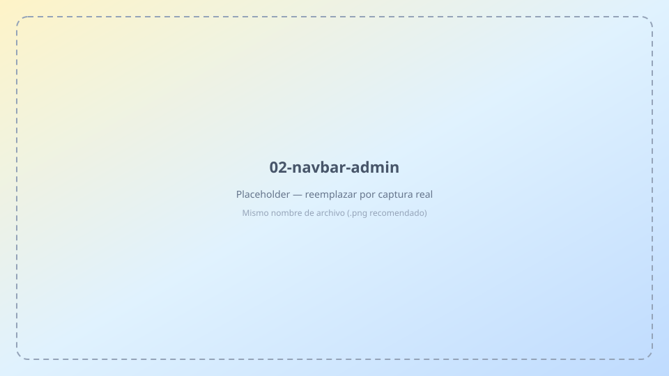
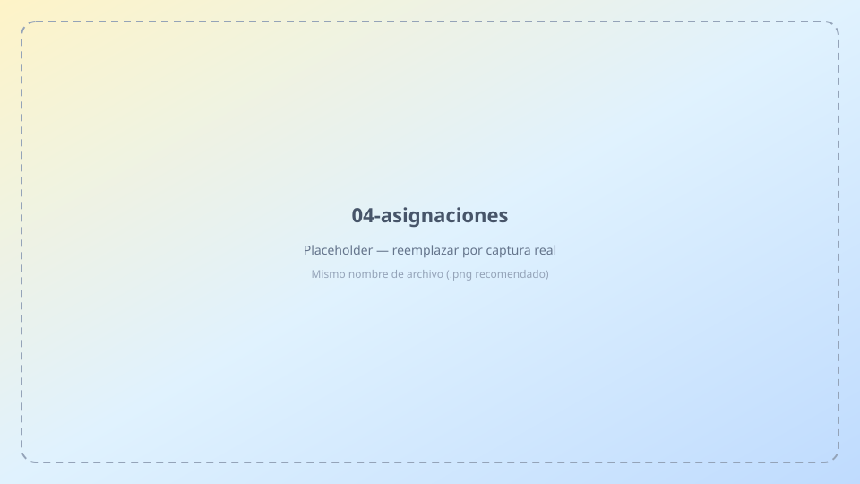
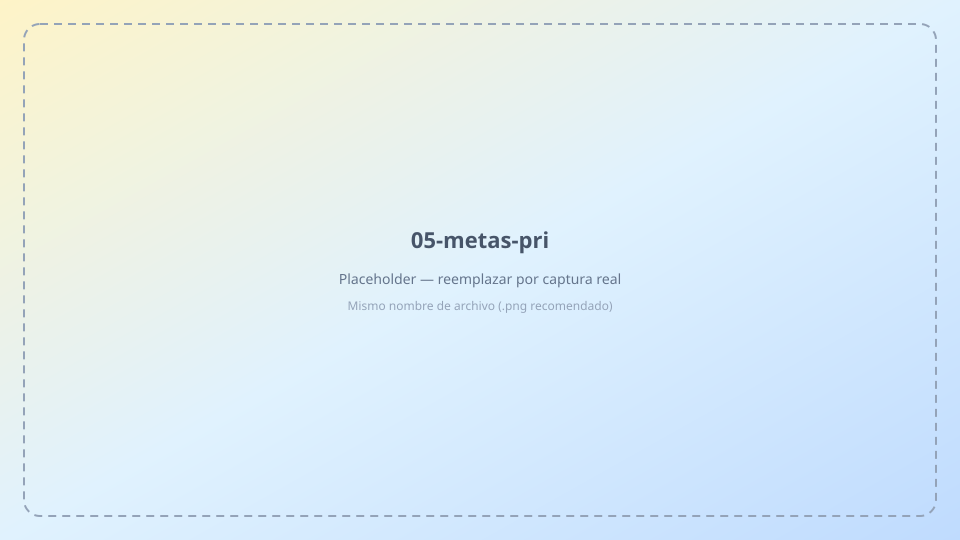
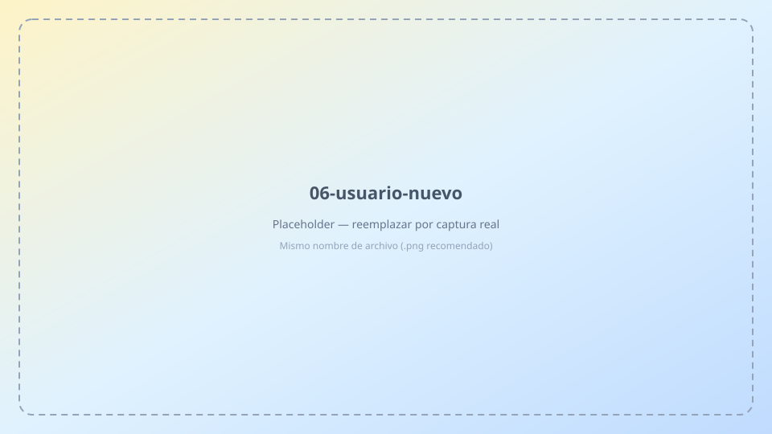
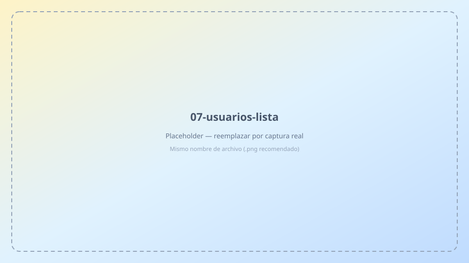
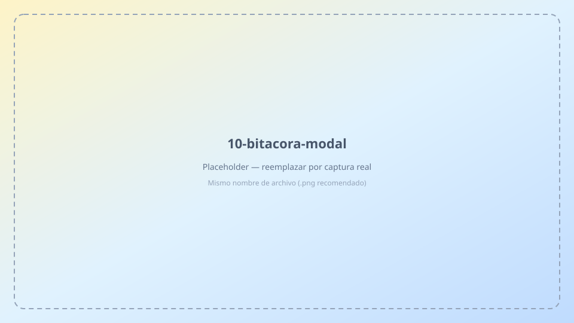
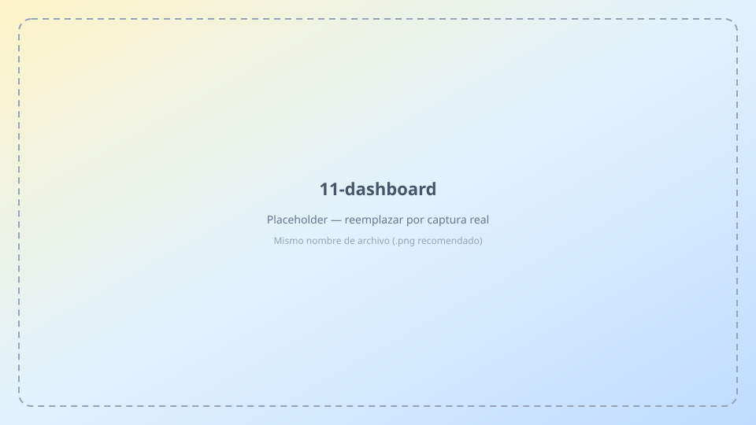
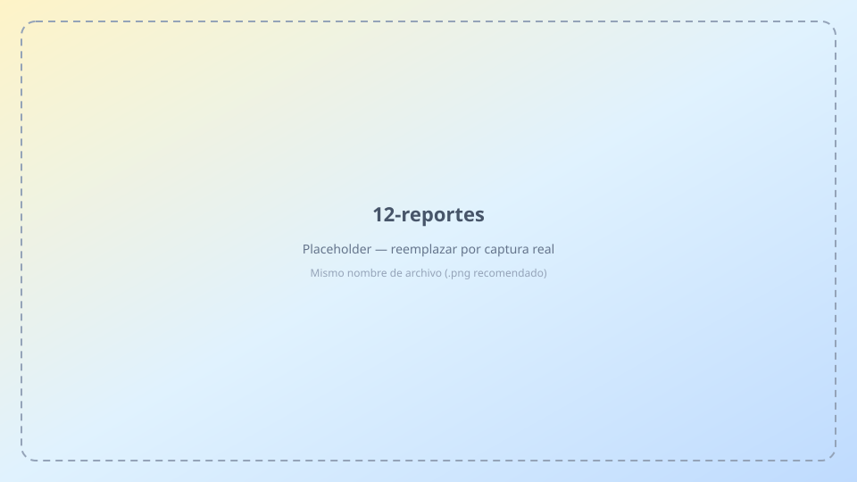
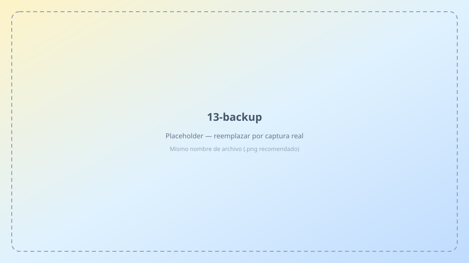

# Manual del administrador · KPI Tracker

Guía para configurar personal, metas, usuarios y operación completa del sistema.

---

## 1. Acceso

**URL:** [Iniciar sesión](/#/login)


1. Ingresa tu **correo** y **contraseña** de administrador.
2. Pulsa **Entrar**.

> Las credenciales se crean en Supabase (Authentication → Users). No uses la contraseña del panel supabase.com.

---

## 2. Navegación (admin)

Como administrador ves **todas** las secciones del menú.



| Sección | Función |
|---------|---------|
| Dashboard | Metas del equipo o por persona |
| Bitácora | Registrar ventas (cualquier persona) |
| Reportes | Análisis, Excel y respaldo JSON |
| Personal | Catálogo de vendedoras |
| Servicios | KPIs / catálogo de servicios |
| Asignaciones | Metas por persona y PRI |
| Usuarios | Cuentas de acceso y roles |
| **Ayuda** | Manuales de usuario (este documento y manual representante) |

---

## 3. Flujo: alta de un representante (completo)

```
Personal → Asignaciones (+ PRI) → Usuarios → entrega credenciales
```

### 3.1 Crear personal (obligatorio)

**Menú → Personal → + Nuevo**


- Completa al menos **Nombre**.
- Guarda. Debe quedar **Activa**.

### 3.2 Asignaciones y meta PRI (recomendado)

**Menú → Asignaciones**



1. Selecciona el **periodo** (mes actual).
2. Filtra por la persona.
3. **Generar todas** — crea metas de todos los servicios activos.
4. Ajusta objetivos si hace falta.

**Metas PRI · Ingresos** (misma pantalla):



- Define el objetivo mensual en **RD$** por persona.
- Pulsa **Guardar** (icono disco) en cada fila.

### 3.3 Crear usuario representante (obligatorio)

**Menú → Usuarios → + Nuevo usuario**



| Campo | Regla |
|-------|-------|
| Correo | Sin errores de escritura |
| Contraseña | Mín. 6 caracteres; anótala para entregar |
| Rol | **Representante de venta** |
| Persona enlazada | Obligatorio |



- **Desactivar** impide el login (no borra datos).
- No puedes desactivarte a ti mismo (badge **tú**).
- Reset de contraseña ajena: **Supabase → Authentication → Users**.

### 3.4 Error al crear usuario («correo ya registrado» o cuenta inactiva)

Si al pulsar **Crear usuario** aparece un mensaje como *«Ya existe un usuario con ese correo»* o *«Este correo ya tiene una cuenta inactiva…»*, **no intentes crearlo de nuevo** con el mismo correo. La cuenta ya existe en el sistema (a veces quedó **inactiva** tras un intento anterior o porque alguien la desactivó).

**Qué hacer desde la pantalla Usuarios (sin Supabase):**

1. **Menú → Usuarios**.
2. Marca la casilla **Ver inactivos** (arriba a la derecha de la lista).
3. Busca el correo en la tabla. Si la fila aparece atenuada y el badge dice **Inactivo**, ese es el usuario.
4. Pulsa el botón **Activar** (icono de encendido) en esa fila.
5. Si hace falta ajustar **rol** o **persona enlazada**, pulsa **Editar** (lápiz), corrige y guarda.
6. Entrega las credenciales. Si no recuerda la contraseña: **Supabase → Authentication → Users** → usuario → reset / recovery.

**Cuándo revisar Supabase (solo si sigue fallando):**

| Revisar | Dónde | Qué buscar |
|---------|--------|------------|
| ¿Existe el correo? | Authentication → Users | Mismo email que intentas crear |
| ¿Perfil enlazado? | SQL Editor (opcional) | Fila en `perfiles` con ese email, rol y `personalId` |
| Confirm email | Authentication → Providers → Email | Debe estar **desactivado** |

> El log de Postgres `schema_migrations does not exist` **no** indica este problema; ignóralo para altas de usuario.

---

## 4. Servicios (KPI)

**Menú → Servicios**


- Catálogo de KPIs (15 servicios precargados al primer uso).
- **Objetivo mensual** = meta por defecto al generar asignaciones.
- **Activo** = disponible para asignaciones y bitácora.

---

## 5. Bitácora (vista admin)

**Menú → Bitácora**


Puedes filtrar por **persona** y registrar ventas en nombre de cualquiera.



| Campo | Regla |
|-------|-------|
| Cantidad | ≥ 0 |
| Monto (RD$) | ≥ 0 → suma al **PRI** |
| Tipo | Venta o Reclamación (ambas suman al PRI) |

---

## 6. Dashboard

**Menú → Dashboard**



- Filtra **persona** o **todo el equipo**.
- Elige **periodo** (mes).
- Tarjetas por servicio + bloque **PRI · Ingresos**.
- Clic en tarjeta → detalle de ventas del servicio.

---

## 7. Reportes

**Menú → Reportes**



- Rango **3 / 6 / 12 meses**.
- Filtro por **persona** y **tipo de gestión**.
- **Excel** — exporta el reporte visible.
- **Exportar / Importar** — respaldo JSON completo (solo admin).



> Importar **sobrescribe** todos los datos. Usar con precaución.

---

## 8. Cerrar sesión


Icono de salida en la barra superior → vuelves al login.

---

## Reglas importantes

- **KPI servicio** = cantidad · **PRI** = monto (RD$).
- Periodo = **YYYY-MM**. Semana laboral: **Lun–Sáb**.
- Un representante = **una persona** enlazada; una persona = **un usuario**.
- Supabase: **Confirm email desactivado** al crear usuarios desde la app.

---

## Problemas frecuentes

| Síntoma | Solución |
|---------|----------|
| Usuario no entra | Verificar correo en Auth; reset password en Supabase |
| Dashboard en cero | Generar asignaciones del mes |
| PRI en cero | Definir meta PRI + montos en bitácora |
| «No se pudo guardar» / correo ya existe | Ver **§ 3.4**: Usuarios → Ver inactivos → Activar → Editar si hace falta |
| Error al crear usuario en Auth (trigger) | Re-ejecutar `supabase/schema.sql` (trigger perfiles) |
| Email "Waiting for verification" | Desactivar Confirm email en Supabase |

---

## Checklist nuevo representante

- [ ] Personal creado y activo
- [ ] Asignaciones del mes
- [ ] Meta PRI en RD$
- [ ] Usuario con correo correcto y persona enlazada
- [ ] Credenciales entregadas
- [ ] Prueba de login y bitácora
