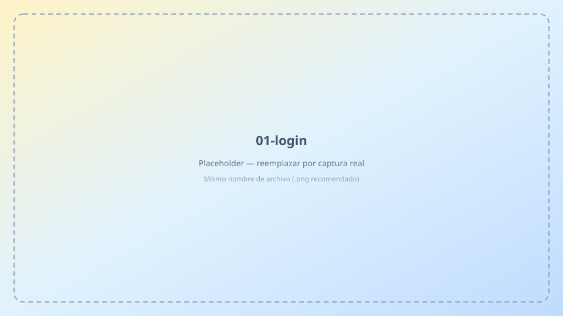
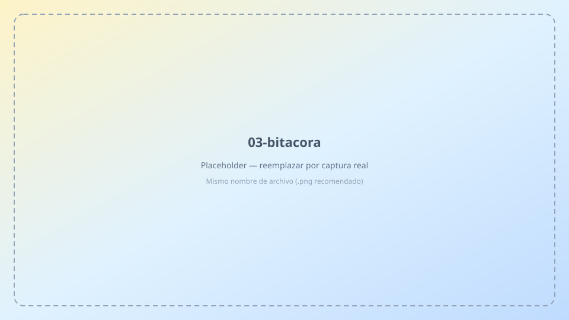
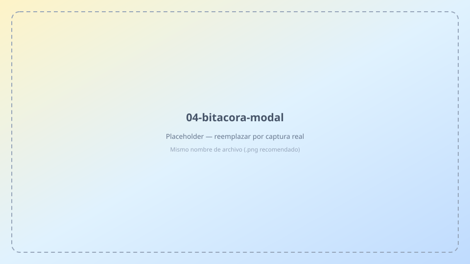
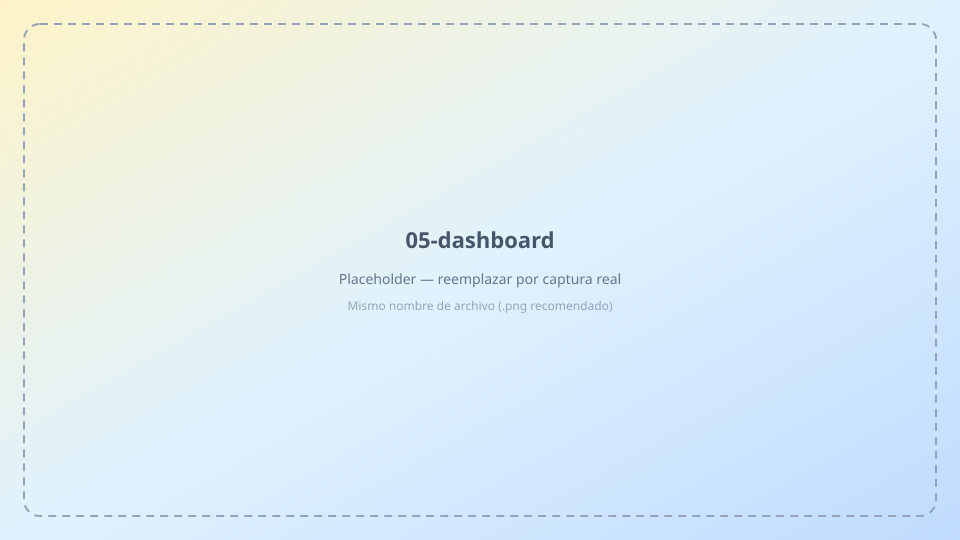
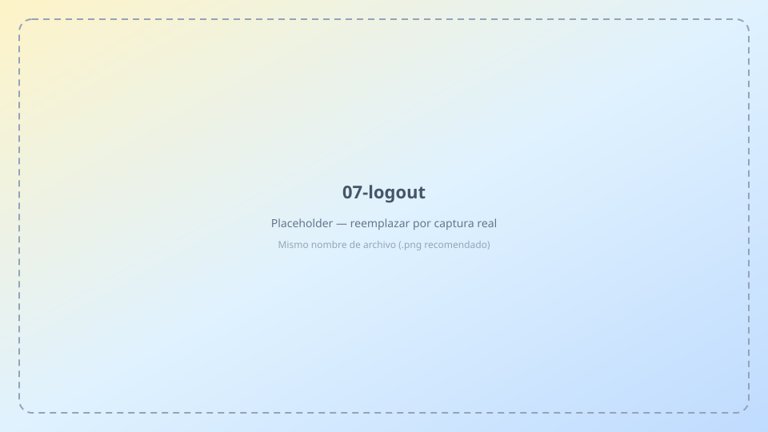

# Manual del representante · KPI Tracker

Guía para iniciar sesión, registrar ventas en la **Bitácora** y consultar tus resultados.

---

## 1. Acceso

**URL:** [Iniciar sesión](/#/login)



1. Ingresa el **correo** y la **contraseña** que te entregó el administrador.
2. Pulsa **Entrar**.

> Si no puedes entrar, pide al admin que verifique tu correo (sin typos) o que resetee tu contraseña.

---

## 2. Qué puedes hacer


| Sección | Para qué sirve |
|---------|----------------|
| **Dashboard** | Ver tus metas y avance del mes |
| **Bitácora** | Registrar ventas y gestiones del día |
| **Reportes** | Consultar tu desempeño e exportar Excel |
| **Ayuda** | Este manual (autoservicio) |

No tienes acceso a Personal, Servicios, Asignaciones ni Usuarios.

---

## 3. Bitácora diaria

**Menú → Bitácora**



1. Confirma la **fecha** (normalmente hoy).
2. Revisa el resumen del día (cantidad + monto PRI).
3. Pulsa **+ Nuevo registro**.



| Campo | Obligatorio | Notas |
|-------|-------------|-------|
| Servicio | Sí | Ej. PREPAGO, POSPAGO… |
| Cantidad | Sí | ≥ 0 unidades |
| Monto (RD$) | Sí | ≥ 0; alimenta el KPI **PRI** |
| Tipo de gestión | Sí | Venta o Reclamación |
| Cliente / numeración / detalle | No | Opcional |

4. **Guardar** → mensaje verde de confirmación.

### Editar o eliminar

- Icono **lápiz** → modificar → Guardar.
- Icono **papelera** → confirmar eliminación.

Solo puedes gestionar **tus** registros.

---

## 4. Dashboard

**Menú → Dashboard**



- Ves **Mis resultados** (no puedes cambiar de persona).
- Elige el **periodo** (mes).
- Totales: objetivo, logrado, restante, proyectado.
- Tarjetas por servicio + bloque **PRI · Ingresos** (RD$).
- Clic en una tarjeta → detalle de tus ventas de ese servicio.

> Si ves metas en cero, el administrador debe asignarte servicios y meta PRI del mes.

---

## 5. Reportes

**Menú → Reportes**


- Rango de **3, 6 o 12 meses**.
- Filtro **tipo de gestión** (todas / venta / reclamación).
- Tabla mensual, resumen PRI y detalle por servicio.
- **Excel** — descarga tu reporte.

---

## 6. Cerrar sesión



Icono de salida (puerta) en la barra superior.

---

## Reglas importantes

- **Cantidad** y **monto** deben ser **≥ 0**.
- **Venta** y **Reclamación** **ambas suman** al PRI (ingresos).
- Cada registro tiene **fecha**; usa el selector de fecha en Bitácora.
- No compartas tu contraseña.

---

## Problemas frecuentes

| Problema | Qué hacer |
|----------|-----------|
| "Correo o contraseña incorrectos" | Verifica datos con el admin |
| No guarda en Bitácora | Admin debe enlazarte a una persona en Usuarios |
| Dashboard vacío | Pide al admin asignaciones del mes |
| No veo un servicio | El admin debe tenerlo activo en Servicios |

---

## Tarjeta rápida (guardar en el teléfono)

```
KPI Tracker
Login: [URL de la app]/#/login
Correo: [tu correo]
Clave: [tu clave]

Bitácora → + Nuevo → Servicio, Cantidad, Monto, Tipo → Guardar
```

Contacto admin: *(completar)*
